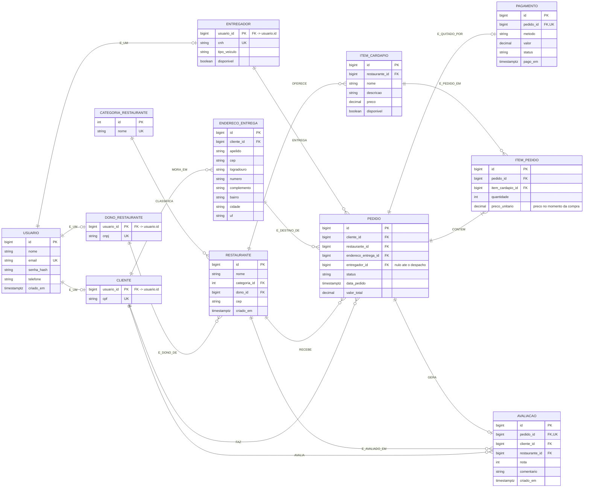

# Etapa 1 — Modelagem conceitual e lógica

Gabarito da Etapa 1 do JFood, correspondente à Aula 1 (Fundamentos de Bancos de Dados Relacionais).

**Contexto.** No JFood, um **cliente** faz um **pedido** em um **restaurante**, escolhendo itens do
cardápio. O pedido é entregue por um **entregador** em um dos **endereços** do cliente, e é quitado
por um **pagamento**.

---

## 1. As entidades, classificadas

O critério é **dependência existencial**, o mesmo que faz `cartao_credito` depender de `assinatura`
no Javify: a entidade é fraca quando não consegue ser identificada sem o pai, e deixa de fazer
sentido no instante em que o pai some.

| Entidade | Forte ou fraca | Por quê |
|---|---|---|
| `usuario` | Forte | Existe por si: tem e-mail próprio, que é a identidade dele no sistema |
| `cliente`, `entregador`, `dono_restaurante` | Especializações | Não são fracas: são **o mesmo** usuário visto por um papel. A PK é a do usuário |
| `restaurante` | Forte | Tem CNPJ, nome e vida própria. Sobrevive ao dono trocar de conta |
| `item_cardapio` | Forte (dependente) | Tem identidade própria e é referenciado por pedidos antigos. Depende do restaurante por FK, mas não é identificado por ele |
| `pedido` | Forte | O número do pedido é a identidade que o cliente lê no app e o suporte usa |
| `item_pedido` | **Fraca** | "2 pizzas a R$ 44,90" não significa nada fora do pedido 137. Apagou o pedido, apagou o item |
| `endereco_entrega` | **Fraca** | "Casa" só existe em relação a um cliente. O apelido é único **dentro** do cliente, não no sistema |
| `pagamento` | **Fraca** | Não existe pagamento sem o pedido que ele quita |
| `avaliacao` | **Fraca** | Avalia-se **um pedido entregue**. Sem o pedido, não há o que avaliar |

> A diferença que mais confunde é entre `item_cardapio` e `item_pedido`. Os dois "pertencem" a um
> pai, mas só o segundo é fraco: um item de cardápio continua existindo — e continua sendo o nome
> que aparece no histórico de quem já pediu — mesmo que ninguém o peça nunca mais.

## 2. O atributo multivalorado: os endereços do cliente

Um cliente tem vários endereços de entrega, cada um com apelido e complemento.

**Por que `enderecos VARCHAR(500)` é um erro.** Ele viola a **1FN**, que exige valores atômicos.
As consequências não são teóricas:

- não dá para consultar por CEP sem `LIKE '%...%'`, que não usa índice (Aula 2);
- não dá para pôr `NOT NULL` no logradouro de um endereço só;
- alterar o complemento de um endereço vira reescrita da string inteira, com risco de corromper
  os outros;
- não dá para o `pedido` **referenciar** o endereço em que foi entregue — e essa referência é
  obrigatória, porque o cliente pode mudar de casa depois.

**A solução** é a tabela `endereco_entrega`, com FK para `cliente` e `UNIQUE (cliente_id, apelido)`:
"Casa" pode se repetir entre clientes, mas não dentro do mesmo cliente.

## 3. O N:N com atributos: pedido × itens do cardápio

Um pedido tem vários itens do cardápio; um item do cardápio aparece em vários pedidos. `quantidade`
e `preco_unitario` **não cabem em nenhuma das duas pontas**: não são propriedade do pedido (variam
por item) nem do item de cardápio (variam por pedido). Eles moram na tabela associativa
`item_pedido`, que é onde os dois se encontram.

**Por que o preço é copiado, e não lido do cardápio.** O cardápio muda: o restaurante reajusta a
pizza de R$ 44,90 para R$ 52,00. Se o histórico lesse o preço atual, o pedido de março passaria a
exibir o preço de setembro — e a soma dos itens deixaria de bater com o valor cobrado no cartão.

O `preco_unitario` do `item_pedido` não é redundância: é um **fato histórico**, o preço que valia
no instante da compra. Só parece duplicação de `item_cardapio.preco` porque, no dia do pedido, os
dois coincidem. O mesmo raciocínio vale para nota fiscal, folha de pagamento e extrato bancário.

> É a distinção entre **dado corrente** e **dado histórico**. A 3FN manda eliminar dependência
> transitiva de dado corrente; ela não manda jogar fora o passado.

## 4. A especialização: cliente, entregador e dono de restaurante

Os três têm nome, e-mail e senha; cada um tem atributos próprios (CNH e tipo de veículo para o
entregador, CNPJ para o dono). As três estratégias clássicas, avaliadas pelo **custo nas duas
consultas que o JFood mais faz**: login por e-mail e listagem de entregadores disponíveis.

| Estratégia | Login por e-mail | Entregadores disponíveis | Integridade |
|---|---|---|---|
| **Tabela única** (`usuario` com todas as colunas + discriminador) | 1 tabela, 1 índice — ótimo | `WHERE tipo = 'ENTREGADOR' AND disponivel` — ótimo | Ruim: `cnh`, `cnpj` e `tipo_veiculo` **têm de ser nulos**, e o banco não consegue exigir CNH de entregador |
| **Tabela por subclasse** (`usuario` + `cliente`/`entregador`/`dono_restaurante`) | 1 tabela, 1 índice — ótimo | 1 JOIN entre `entregador` e `usuario` | Ótima: `NOT NULL` real em `cnh` e `cnpj`, `UNIQUE` por papel |
| **Tabela por classe concreta** (três tabelas independentes) | **3 consultas** ou um `UNION` — o pior caso, e é a consulta mais frequente do sistema | 1 tabela — ótimo | Ruim: o `UNIQUE` do e-mail **não é global**; o mesmo e-mail pode existir em duas tabelas |

**Escolha: tabela por subclasse.**

O que decide é o login. Ele roda em toda abertura do app, é a consulta mais frequente do sistema e,
na tabela por classe concreta, ele custa três buscas — ou um `UNION` que nenhum índice resolve
inteiro. Pior: sem uma tabela base, **não existe lugar onde declarar `UNIQUE (email)`** valendo para
todo mundo, e um entregador pode se cadastrar como cliente com o mesmo e-mail. Essa não é uma
consulta lenta; é um bug de identidade.

Contra a tabela única pesa o outro lado: `cnh VARCHAR(11)` teria de ser nula (senão nenhum cliente
se cadastra), e aí o banco perde a capacidade de garantir que **todo entregador tem CNH**. A
validação migra para a aplicação, que é onde ela costuma escapar.

O preço da escolha é um JOIN na listagem de entregadores — que roda no despacho, não a cada abertura
de tela, e sobre uma tabela pequena. É o trade-off certo.

> Na Aula 3 isso vira `@Inheritance(strategy = InheritanceType.JOINED)`, com `@PrimaryKeyJoinColumn`
> nas subclasses. As três estratégias do MER têm nome idêntico na JPA — `SINGLE_TABLE`, `JOINED` e
> `TABLE_PER_CLASS` — porque são a mesma decisão, tomada duas vezes.

## 5. Da "tabela monstro" à 3FN

O ponto de partida:

| pedido_id | cliente_nome | cliente_telefones | restaurante_nome | restaurante_categoria | itens | cep_entrega | cidade | valor_total |
|---|---|---|---|---|---|---|---|---|
| 1 | Ana | 11 9999-9999, 11 8888-8888 | Cantina do Zé | Italiana | Pizza x2, Refri x1 | 01311000 | São Paulo | 89,80 |

### 1FN — atomicidade

**Problema:** `cliente_telefones` e `itens` guardam listas dentro de uma célula.

**O que a 1FN resolve:** cada valor passa a ser atômico e cada repetição vira linha.

- `cliente_telefones` → o telefone vira coluna de `usuario` (o JFood guarda um por cadastro; se
  guardasse vários, seria uma tabela `usuario_telefone`, como no Javify);
- `itens` → tabela **`item_pedido`**, uma linha por item, com `quantidade` e `preco_unitario`.

Depois da 1FN o pedido 1 já não é uma linha: é uma linha em `pedido` e duas em `item_pedido`.

### 2FN — dependência total da chave

**Problema:** com a chave composta `(pedido_id, item)` — que é o que a linha de fato representava —
`cliente_nome`, `restaurante_nome` e `cep_entrega` dependem **só de `pedido_id`**, não do item. São
dependências parciais: repetem-se em toda linha de item do mesmo pedido.

**O que a 2FN resolve:** o que depende só do pedido fica em `pedido`; o que depende do par
pedido-item fica em `item_pedido`. E as entidades que só estavam sendo copiadas — cliente e
restaurante — ganham tabela própria, referenciadas por FK.

### 3FN — dependência transitiva

**Problema:** `restaurante_categoria` não depende do pedido; depende do **restaurante**, que depende
do pedido. É transitiva: `pedido_id → restaurante_nome → restaurante_categoria`. Mesma coisa com
`cidade`, que depende do CEP, e não do pedido.

**O que a 3FN resolve:**

- `restaurante_categoria` → tabela **`categoria_restaurante`**, com FK em `restaurante`. Renomear
  "Italiana" para "Cozinha italiana" passa a ser um `UPDATE` em **uma** linha, e não em todos os
  restaurantes italianos;
- `cidade` (e `bairro`, `logradouro`) → atributos de **`endereco_entrega`**, apontado pelo pedido.
  O pedido guarda a **referência ao endereço**, não uma cópia solta do CEP.

### O que cada Forma Normal eliminou

| FN | Anomalia eliminada |
|---|---|
| 1FN | Não dava para consultar nem indexar um telefone ou um item — só varrer strings |
| 2FN | O nome do cliente era regravado em cada item do pedido: **anomalia de atualização** (corrigir o nome em um item e não nos outros) |
| 3FN | Uma categoria nova só podia existir se houvesse um restaurante dela: **anomalia de inserção**. E apagar o último restaurante italiano apagava a existência da categoria: **anomalia de exclusão** |

## 6. Esquema lógico final

Cada bloco vira um `CREATE TABLE` na Etapa 2; cada FK vira uma constraint `FOREIGN KEY`.

```
usuario (
    id          BIGSERIAL     PRIMARY KEY,
    nome        VARCHAR(100)  NOT NULL,
    email       VARCHAR(150)  NOT NULL UNIQUE,
    senha_hash  VARCHAR(60)   NOT NULL,
    telefone    VARCHAR(20),
    criado_em   TIMESTAMPTZ   NOT NULL DEFAULT NOW()
)

cliente (
    usuario_id  BIGINT       PRIMARY KEY REFERENCES usuario(id),
    cpf         VARCHAR(11)  NOT NULL UNIQUE
)

entregador (
    usuario_id    BIGINT       PRIMARY KEY REFERENCES usuario(id),
    cnh           VARCHAR(11)  NOT NULL UNIQUE,
    tipo_veiculo  VARCHAR(20)  NOT NULL CHECK (tipo_veiculo IN ('MOTO','BICICLETA','CARRO','A_PE')),
    disponivel    BOOLEAN      NOT NULL DEFAULT TRUE
)

dono_restaurante (
    usuario_id  BIGINT       PRIMARY KEY REFERENCES usuario(id),
    cnpj        VARCHAR(14)  NOT NULL UNIQUE
)

endereco_entrega (
    id           BIGSERIAL     PRIMARY KEY,
    cliente_id   BIGINT        NOT NULL REFERENCES cliente(usuario_id),
    apelido      VARCHAR(30)   NOT NULL,
    cep          VARCHAR(8)    NOT NULL,
    logradouro   VARCHAR(150)  NOT NULL,
    numero       VARCHAR(10)   NOT NULL,
    complemento  VARCHAR(60),
    bairro       VARCHAR(100)  NOT NULL,
    cidade       VARCHAR(100)  NOT NULL,
    uf           CHAR(2)       NOT NULL,
    UNIQUE (cliente_id, apelido)
)

categoria_restaurante (
    id    SERIAL       PRIMARY KEY,
    nome  VARCHAR(50)  NOT NULL UNIQUE
)

restaurante (
    id            BIGSERIAL     PRIMARY KEY,
    nome          VARCHAR(120)  NOT NULL,
    categoria_id  INT           NOT NULL REFERENCES categoria_restaurante(id),
    dono_id       BIGINT        NOT NULL REFERENCES dono_restaurante(usuario_id),
    cep           VARCHAR(8)    NOT NULL,
    criado_em     TIMESTAMPTZ   NOT NULL DEFAULT NOW()
)

item_cardapio (
    id              BIGSERIAL      PRIMARY KEY,
    restaurante_id  BIGINT         NOT NULL REFERENCES restaurante(id),
    nome            VARCHAR(120)   NOT NULL,
    descricao       VARCHAR(255),
    preco           NUMERIC(10,2)  NOT NULL CHECK (preco >= 0),
    disponivel      BOOLEAN        NOT NULL DEFAULT TRUE
)

pedido (
    id                   BIGSERIAL      PRIMARY KEY,
    cliente_id           BIGINT         NOT NULL REFERENCES cliente(usuario_id),
    restaurante_id       BIGINT         NOT NULL REFERENCES restaurante(id),
    endereco_entrega_id  BIGINT         NOT NULL REFERENCES endereco_entrega(id),
    entregador_id        BIGINT         REFERENCES entregador(usuario_id),
    status               VARCHAR(20)    NOT NULL DEFAULT 'CRIADO'
                                        CHECK (status IN ('CRIADO','CONFIRMADO','EM_PREPARO',
                                                          'A_CAMINHO','ENTREGUE','CANCELADO')),
    data_pedido          TIMESTAMPTZ    NOT NULL DEFAULT NOW(),
    valor_total          NUMERIC(10,2)  NOT NULL DEFAULT 0
)

item_pedido (
    id                BIGSERIAL      PRIMARY KEY,
    pedido_id         BIGINT         NOT NULL REFERENCES pedido(id),
    item_cardapio_id  BIGINT         NOT NULL REFERENCES item_cardapio(id),
    quantidade        INT            NOT NULL CHECK (quantidade > 0),
    preco_unitario    NUMERIC(10,2)  NOT NULL CHECK (preco_unitario >= 0),
    UNIQUE (pedido_id, item_cardapio_id)
)

pagamento (
    id         BIGSERIAL      PRIMARY KEY,
    pedido_id  BIGINT         NOT NULL UNIQUE REFERENCES pedido(id),
    metodo     VARCHAR(20)    NOT NULL CHECK (metodo IN ('CARTAO_CREDITO','CARTAO_DEBITO','PIX','DINHEIRO')),
    valor      NUMERIC(10,2)  NOT NULL CHECK (valor >= 0),
    status     VARCHAR(20)    NOT NULL CHECK (status IN ('PENDENTE','APROVADO','RECUSADO','ESTORNADO')),
    pago_em    TIMESTAMPTZ
)

avaliacao (
    id              BIGSERIAL     PRIMARY KEY,
    pedido_id       BIGINT        NOT NULL UNIQUE REFERENCES pedido(id),
    cliente_id      BIGINT        NOT NULL REFERENCES cliente(usuario_id),
    restaurante_id  BIGINT        NOT NULL REFERENCES restaurante(id),
    nota            SMALLINT      NOT NULL CHECK (nota BETWEEN 1 AND 5),
    comentario      VARCHAR(500),
    criado_em       TIMESTAMPTZ   NOT NULL DEFAULT NOW()
)
```

Decisões que valem comentário:

- **`NUMERIC(10,2)` em todo dinheiro.** Nunca `FLOAT`: `0,1 + 0,2` em ponto flutuante binário não dá
  `0,3`, e um centavo perdido por pedido vira relatório que não fecha.
- **`TIMESTAMPTZ`, não `TIMESTAMP`.** Um app de delivery nacional tem clientes em fusos diferentes;
  o `TZ` guarda o instante, não a leitura do relógio de quem gravou.
- **A PK das especializações é a PK do usuário.** `cliente.usuario_id` é PK **e** FK ao mesmo tempo:
  é isso que impede um usuário de virar dois clientes.
- **`pedido.entregador_id` é nulo** enquanto o pedido não foi despachado. É o único nulo do esquema
  que significa alguma coisa — "ainda não aconteceu" —, e não falta de informação.
- **`avaliacao.restaurante_id` é derivável** de `pedido.restaurante_id`. Está aqui de propósito, para
  que a listagem de avaliações de um restaurante (Etapa 6) e o grafo de recomendação (Etapa 11) não
  precisem do JOIN com `pedido` a cada leitura. É a primeira desnormalização consciente do projeto —
  e o `UNIQUE (pedido_id)` mantém a coerência de que só há uma avaliação por pedido.

> `pedido.observacao` e `pedido.taxa_entrega` **não estão aqui**: eles chegam por `ALTER TABLE` na
> Etapa 2, que é justamente o exercício de mexer no esquema depois que ele já existe.

### Diagrama entidade-relacionamento

O arquivo é [`docs/modelo/jfood-mer.mmd`](modelo/jfood-mer.mmd).


---

## A decisão sobre `valor_total`: coluna ou recálculo?

A pergunta que a Etapa 6 vai cobrar de volta. Os dois lados têm defesa:

**A favor de recalcular** (`SUM(quantidade * preco_unitario)` sobre `item_pedido`): é a única forma
que **não pode divergir**. O total é derivado dos itens por definição; guardá-lo é guardar duas
versões da mesma verdade, e duas versões da mesma verdade acabam discordando — basta um item ser
inserido por um caminho que esqueceu de atualizar a soma.

**A favor da coluna:** o total é lido em toda listagem de histórico e em todo relatório de
faturamento, e é escrito uma vez só. Recalcular obriga a agregar `item_pedido` em cada leitura;
com um cliente de 300 pedidos, a tela de histórico vira 300 agregações.

E há um argumento mais forte que o desempenho: `valor_total` é **o valor cobrado do cliente**. Ele
inclui taxa de entrega e desconto de cupom, e passa por arredondamento. A soma dos itens é um
insumo do total, não o total. Recalcular a partir dos itens produziria um número que, em alguns
pedidos, **não é o que foi cobrado no cartão** — e isso é uma divergência contábil, não uma
otimização.

**Decisão desta implementação: coluna materializada**, mantida pela aplicação em uma transação
única com a gravação dos itens.

O risco assumido — divergir dos itens — é atacado na Etapa 6, onde as três implementações (coluna
mantida pela aplicação, coluna mantida por trigger e cálculo sob demanda em uma view) são medidas
e comparadas em frescor, custo de escrita e risco de divergência.

---

## Critério de pronto

- Nenhuma coluna repete informação que pertence a outra tabela — com uma exceção declarada
  (`avaliacao.restaurante_id`) e uma que não é repetição, e sim fato histórico
  (`item_pedido.preco_unitario`).
- Toda FK aponta para uma PK existente.
- Para cada tabela criada, a anomalia que ela eliminou está nomeada na seção 5.
