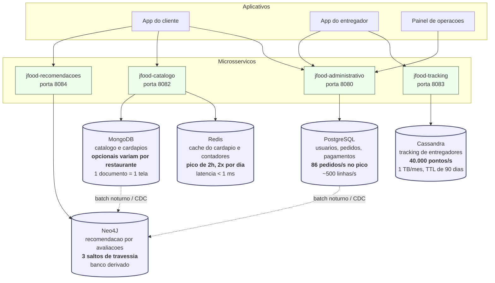
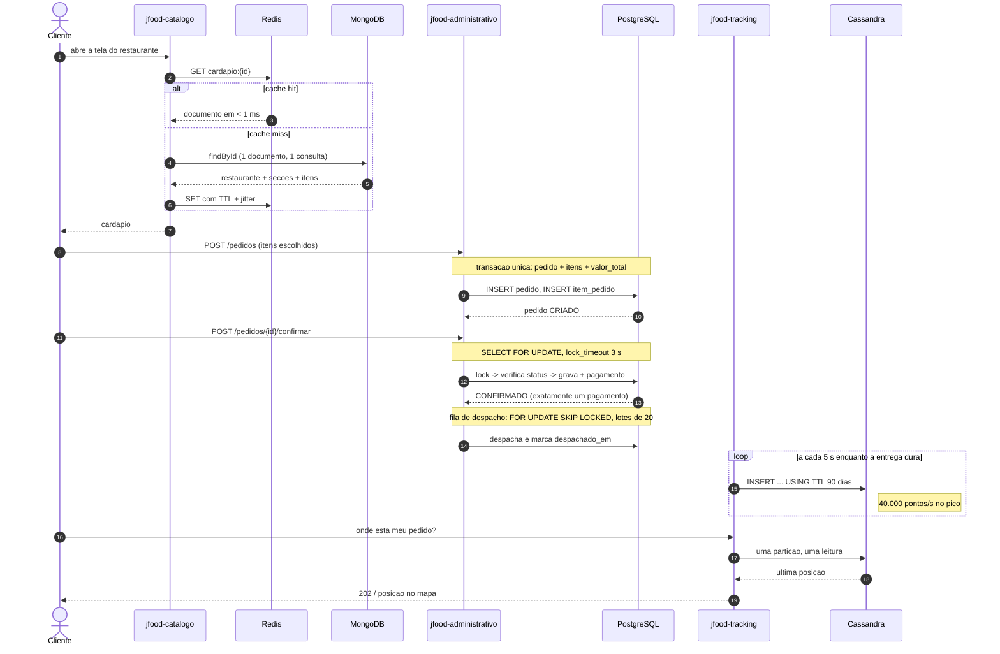

# Etapa 7 — Dimensionando o sistema

Gabarito da Etapa 7 do JFood, correspondente à Aula 7. Esta etapa não tem código: é papel e caneta,
e é ela que decide o que será construído nas quatro seguintes.

**Critério de pronto:** cada escolha de banco vem acompanhada de um **número**, e não de um adjetivo.
"Cassandra porque são 40 mil escritas por segundo" vale; "Cassandra porque é mais rápido" não vale.

---

## 1. As contas de guardanapo

### Premissas do enunciado

| Premissa | Valor |
|---|---|
| Clientes cadastrados | 30.000.000 |
| Ativos na janela de pico (19h–21h) | 12% |
| Pedidos por cliente ativo, por semana | 1,2 |
| Entregadores simultâneos no pico | 200.000 |
| Ping de GPS | 1 a cada 5 s |
| Tamanho de um ponto | 40 bytes |

### Pedidos por segundo no pico

```
clientes ativos       = 30.000.000 × 12%          = 3.600.000
pedidos por semana    = 3.600.000 × 1,2           = 4.320.000
pedidos por dia       = 4.320.000 / 7             =   617.143
janela de pico        = 2 h                       =     7.200 s
```

> **Premissa assumida, e ela importa:** que **todos** os pedidos do dia acontecem na janela de pico.
> É o pior caso, e é o que se dimensiona. Delivery tem dois picos concentrados (almoço e jantar) com
> um vale enorme entre eles — arredondar isso para "tudo no pico" erra para o lado seguro.

```
pedidos/s no pico     = 617.143 / 7.200           =        86 pedidos/s
```

Em **linhas gravadas**, que é o que o banco sente: cada pedido são ~6 `INSERT` (1 pedido + ~3 itens
+ 1 pagamento + 1 auditoria).

```
linhas/s no pico      = 86 × 6                    =       514 linhas/s
```

### Coordenadas GPS por segundo

```
pings/s               = 200.000 / 5               =    40.000 pontos/s
bytes/s               = 40.000 × 40 B             =   1,6 MB/s
```

### Armazenamento de GPS por mês

Assumindo, como a Etapa 10 vai assumir, que um entregador trabalha **6 horas por dia**:

```
pings por entregador/dia = 6 × 3.600 / 5          =       4.320
pontos/dia               = 200.000 × 4.320        = 864.000.000
bytes/dia                = 864.000.000 × 40 B     =   34,56 GB/dia

por mês (30 dias)        = 34,56 × 30             = 1.037 GB  ≈  1,04 TB/mês
por ano                  =                          12,61 TB/ano
com replicação fator 3   = 3,11 TB/mês  |  37,8 TB/ano
```

**Um terabyte por mês, só de coordenadas.** E ele não para de crescer: é uma tabela *append-only* em
que nada é atualizado e nada é apagado — a não ser que alguém decida apagar. (A Etapa 10 decide: TTL
de 90 dias, o que estabiliza o volume bruto em ~3,1 TB replicados.)

## 2. Por que o GPS não cabe no PostgreSQL — e os pedidos cabem

| | Pedidos | GPS |
|---|---|---|
| Escritas por segundo no pico | **514 linhas/s** | **40.000 linhas/s** |
| Crescimento mensal | ~5 GB | **~1 TB** |
| Perfil | Transacional, com leitura e atualização | *Append-only*, nunca atualizado |
| Consistência exigida | ACID, inegociável | Eventual, tolerável |

**A razão é de 78×** — e é ela que decide.

**Os pedidos cabem, com folga.** Um PostgreSQL bem configurado em NVMe sustenta na casa de 5.000 a
15.000 transações de escrita por segundo. 514 linhas/s é **3% a 10%** de um único nó primário. E o
volume mensal do subsistema transacional inteiro é da ordem de gigabytes — cabe em disco por anos,
com índice, `VACUUM` e réplica.

**O GPS não cabe, e não é questão de afinar o servidor.** 40.000 escritas por segundo já são 3× a 8×
o teto de um primário — e escrita no PostgreSQL não é só a linha:

- **WAL** — toda escrita passa pelo write-ahead log, e um único primário serializa esse fluxo. Não
  há como escalar isso horizontalmente: um nó é um nó.
- **Índice B-tree** — todo `INSERT` reequilibra a árvore. Com 864 milhões de linhas por dia, o índice
  fica maior que a RAM e as páginas quentes param de caber em cache.
- **`autovacuum`** — não há `UPDATE` aqui, mas há `DELETE` (a retenção de 90 dias), e apagar centenas
  de milhões de linhas gera trabalho de limpeza que compete com a ingestão.
- **Escala vertical acaba.** Dobrar a máquina resolve uma vez. A curva de GPS não dobra uma vez: ela
  cresce com o número de entregadores, que cresce com o negócio.

**A pergunta que fecha o argumento:** se a ingestão de GPS derrubasse o banco transacional, o cliente
não conseguiria **fazer um pedido**. Um subsistema de conveniência — ver a moto se mexendo no mapa —
teria derrubado o subsistema que gera receita. Separar os dois não é preferência arquitetural, é
**isolamento de falhas**.

## 3. CP ou AP, por subsistema

O Teorema CAP só decide alguma coisa quando há partição de rede. A pergunta operacional é: **na hora
em que a rede partir, você prefere devolver um erro ou uma resposta possivelmente desatualizada?**

| Subsistema | CP ou AP? | Por quê |
|---|---|---|
| **Pagamento do pedido** | **CP** | Cobrar duas vezes ou perder uma cobrança é dinheiro. Recusar a operação e pedir para tentar de novo é um inconveniente; divergir é um prejuízo com nome de cliente |
| **Cardápio do restaurante** | **AP** | Mostrar um preço de 30 s atrás não quebra nada — o valor cobrado é o do pedido, e a Etapa 1 já copiou o preço para `item_pedido`. Tela fora do ar no pico do almoço, sim, quebra |
| **Posição do entregador no mapa** | **AP** | O dado vale por 5 segundos e é substituído pelo próximo ping. Uma coordenada perdida não muda nada; um mapa que não abre irrita todo mundo |
| **Avaliação/nota do restaurante** | **AP** | Nota média é agregado estatístico. Uma avaliação demorar um minuto para entrar na média não é perceptível, e ninguém toma decisão irreversível com base nela |
| **Estoque de um cupom promocional** | **CP** | É contagem com limite rígido: 100 unidades são 100. Sob partição, dois nós contando separadamente resgatariam 200 — e o marketing teria de honrar ou desapontar 100 clientes |

**O padrão que emerge:** vai para CP o que **conta** e o que **cobra**; vai para AP o que **exibe**.
E não por acaso, é exatamente a divisão de bancos das próximas aulas.

## 4. A shard key do tracking

Três candidatas, para a tabela de rota do entregador:

| Candidata | Tamanho da partição | Distribuição da escrita | Veredito |
|---|---|---|---|
| `entregador_id` | **Ilimitado** — 4.320 pontos/dia × todos os dias que o entregador trabalhar. Em um ano, 1,5 milhão de linhas em uma partição | Boa: 200 mil chaves distintas | Partição cresce sem limite |
| `data` | ~864 milhões de linhas por dia, **em uma partição** | **Catastrófica**: todas as escritas do dia vão para o mesmo nó | ❌ **Hot partition** |
| `(entregador_id, dia)` | **Limitado**: 4.320 pontos, ~170 KB | Boa: 200 mil chaves × 1 por dia | ✅ **A escolhida** |

**`data` é a que cria a *hot partition*, e por um motivo estrutural.** A partition key decide **em
qual nó** o dado é escrito. Se todas as linhas de hoje compartilham a mesma chave, todas as 40.000
escritas por segundo vão para o **mesmo** nó — e os outros 19 do anel ficam ociosos. Você comprou um
cluster e está usando uma máquina. Pior: amanhã o gargalo muda de nó, mas continua sendo um nó só.

A intuição enganosa é que `data` "distribui bem porque tem muitos dias". Distribui os **dados
históricos**; não distribui a **escrita de agora** — e é a escrita de agora que derruba o cluster.

**`(entregador_id, dia)` resolve os dois problemas de uma vez:** limita o tamanho da partição (uma
jornada de trabalho) e espalha a escrita por 200 mil chaves ativas simultâneas.

**O custo:** "por onde o entregador X passou nos últimos 7 dias" deixa de ser **uma** leitura de
partição e passa a ser **sete** — uma por dia, montadas pela aplicação. É a troca que se aceita:
sete leituras rápidas e previsíveis, contra uma leitura de uma partição que cresce para sempre.

> Guarde esta seção: ela é, literalmente, a modelagem da Etapa 10.

## 5. Réplicas de leitura e o status do pedido

**O que o usuário pode ver de errado.** Réplica de leitura é assíncrona: há um *lag* de replicação,
normalmente de milissegundos, mas que vira segundos sob carga — e a carga máxima é justamente o pico
do jantar. Os sintomas:

1. **Violação de *read-your-writes*.** O cliente confirma o pedido, o app recarrega a tela e lê da
   réplica: o pedido ainda aparece como `CRIADO`, ou **não aparece**. Da perspectiva dele, o clique
   não funcionou — e ele clica de novo. Foi para reduzir o estrago desse segundo clique que a Etapa 5
   existe.
2. **Status andando para trás.** Duas leituras seguidas caem em réplicas com lags diferentes:
   `A_CAMINHO`, depois `EM_PREPARO`. O pedido "desandou".
3. **Pagamento fantasma.** A tela mostra "aguardando pagamento" quando o cartão já foi debitado — e a
   próxima ligação é para o suporte.

### A política de roteamento do JFood

| Lê do **primary** | Lê de **réplica** |
|---|---|
| Status do pedido **na sessão que acabou de escrever** (confirmar, cancelar, avaliar) | Histórico de pedidos antigos |
| Tela de acompanhamento nos primeiros 60 s após uma ação do cliente | Listagem de restaurantes e cardápios |
| Qualquer coisa que gate dinheiro: pagamento, saldo, estoque de cupom | Avaliações e notas médias |
| Toda escrita, obviamente | Painéis, relatórios e a `mv_faturamento_por_restaurante` da Etapa 6 |

**A regra em uma frase:** *escreveu, lê do primary; só olhando, lê de réplica.*

Na prática, isso é implementado marcando a sessão do cliente por um curto período (um cookie ou uma
chave no Redis com TTL de 60 s, definida em toda escrita) e roteando por essa marca — e não por
adivinhação. No Spring, o `@Transactional(readOnly = true)` **não** faz esse roteamento sozinho: ele
sinaliza a intenção, mas quem escolhe a conexão é um `AbstractRoutingDataSource` ou o proxy à frente
do banco.

> **A materialized view da Etapa 6 é a mesma ideia, uma camada acima.** Ela é uma réplica defasada e
> declarada — com `atualizado_em` dizendo o tamanho do atraso. A pergunta "de onde este número veio e
> quão velho ele é" é a mesma nos dois casos.

## 6. O mapa de persistência poliglota

Arquivo: [`docs/modelo/jfood-persistencia-poliglota.mmd`](modelo/jfood-persistencia-poliglota.mmd)



E o caminho de um pedido pelos serviços — arquivo
[`docs/modelo/jfood-fluxo-pedido.mmd`](modelo/jfood-fluxo-pedido.mmd):



### O custo operacional dessa decisão

Cinco bancos são **cinco sistemas** — e a conta não é de licença, é de gente e de tempo:

| Custo | O que significa na prática |
|---|---|
| **Operar** | Cinco processos de backup, cinco de restore, cinco planos de upgrade. E backup que nunca foi restaurado não é backup |
| **Monitorar** | Cinco conjuntos de métricas e de alertas, cada um com um vocabulário próprio: *lag* de réplica, *tombstones*, *eviction*, *page cache*, tamanho de heap do grafo |
| **Versionar** | Flyway resolve o PostgreSQL. MongoDB, Redis, Cassandra e Neo4J **não têm** equivalente maduro — mudança de esquema neles vira script manual e disciplina |
| **Manter consistente** | O Neo4J é derivado do PostgreSQL e do MongoDB; o Redis é derivado do MongoDB. Todo dado derivado pode divergir, e alguém precisa detectar e reconciliar |
| **Formar equipe** | Ninguém é sênior em cinco bancos. Ou o time carrega cinco especialidades rasas, ou concentra o conhecimento em uma pessoa — que é o pior risco operacional dos cinco |

**A pergunta honesta, que a Etapa 11 vai cobrar:** o JFood, no estágio em que está, justifica os
cinco? Com os números desta etapa, dois são inegociáveis — o PostgreSQL (pelas garantias) e o
Cassandra (pelos 40.000 pontos/s, que nenhum ajuste no relacional alcança). O MongoDB e o Redis são
decisões de produto defensáveis, mas um PostgreSQL com `JSONB` e um cache local levariam o JFood
bem longe. E o Neo4J é uma feature, não uma fundação: se a recomendação por avaliações não for
prioridade de negócio, ele é um banco a menos para operar.

---

## Critério de pronto

Cada banco do diagrama vem com o número que o motivou:

| Banco | O número |
|---|---|
| PostgreSQL | 514 linhas/s no pico — 3% a 10% de um único nó |
| MongoDB | Opcionais que variam por restaurante; 1 documento atende 1 tela sem JOIN |
| Redis | Pico de 2 h, duas vezes por dia; latência abaixo de 1 ms |
| Cassandra | **40.000 pontos/s**, 1,04 TB/mês, 78× a escrita do subsistema transacional |
| Neo4J | Travessia de 3 saltos, cujo custo em SQL explode com a profundidade |
